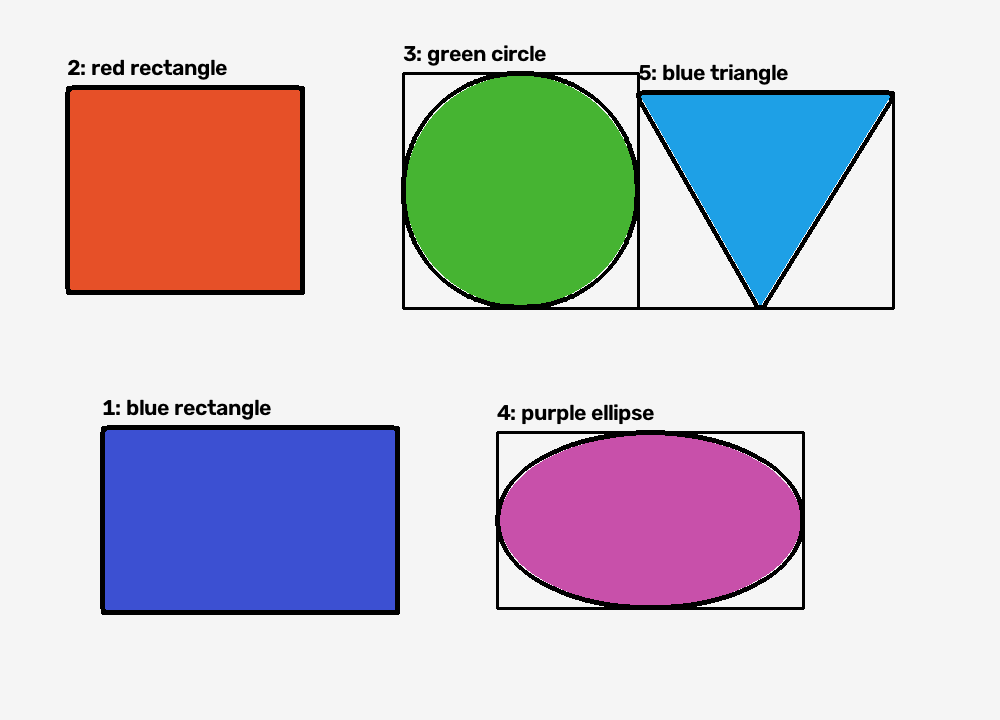

# تصنيف العناصر باستخدام OpenCV و Anaconda

## نبذة عن المشروع

قمت بتنفيذ مشروع بسيط لتصنيف العناصر داخل الصور باستخدام Python و OpenCV داخل بيئة Anaconda. الهدف من المشروع هو قراءة صورة، اكتشاف الأجسام الموجودة بداخلها، ثم تصنيف كل جسم بناء على شكله الهندسي ولونه الغالب.

اعتمدت في الحل على معالجة الصور التقليدية بدلا من تدريب نموذج عميق، لأن المطلوب يمكن إنجازه بكفاءة من خلال OpenCV عند التعامل مع أجسام واضحة وحدود منفصلة.

## ما الذي تم إنجازه

تم بناء برنامج يستطيع تنفيذ الخطوات التالية:

- قراءة صورة من الجهاز أو إنشاء صورة تجريبية تلقائيا.
- اكتشاف الأجسام الموجودة داخل الصورة.
- تصنيف الشكل الهندسي لكل جسم مثل: مثلث، مستطيل، مربع، دائرة، شكل بيضاوي، أو مضلع.
- تحديد اللون الغالب لكل جسم.
- رسم حدود الأجسام وكتابة التصنيف على الصورة.
- حفظ صورة نهائية موضح عليها ناتج التصنيف.
- حفظ النتائج في ملفات منظمة بصيغتي JSON و CSV.

## صورة من ناتج التشغيل

الصورة التالية توضح نتيجة تشغيل البرنامج بعد اكتشاف الأجسام وتصنيفها:



## كيف تم تنفيذ الحل

بدأت بتجهيز بيئة Anaconda للمشروع، ثم استخدمت Python مع مكتبة OpenCV لمعالجة الصورة. في البداية يتم تحميل الصورة وتحويلها إلى تدرج رمادي لتقليل كمية المعلومات غير الضرورية أثناء تحليل الحواف.

بعد ذلك استخدمت Gaussian Blur لتقليل الضوضاء في الصورة، ثم طبقت Canny Edge Detection لاستخراج الحواف الأساسية للأجسام. ولتحسين جودة الحواف الناتجة، تم استخدام عمليات Morphology لإغلاق الفراغات الصغيرة وربط الأجزاء القريبة من بعضها.

بعد تجهيز الصورة، تم استخراج الكونتورات الخارجية باستخدام OpenCV. كل كونتور يمثل جسما محتملا داخل الصورة. تم تجاهل الكونتورات الصغيرة جدا حتى لا يتم تصنيف الضوضاء أو التفاصيل غير المهمة على أنها أجسام حقيقية.

لتصنيف الشكل، تم استخدام `approxPolyDP` لتقريب حدود الجسم إلى عدد أقل من النقاط. بناء على عدد الرؤوس، ونسبة العرض إلى الارتفاع، ومعامل الاستدارة، تم تحديد نوع الشكل. على سبيل المثال، الشكل ذو ثلاثة رؤوس يصنف كمثلث، والشكل ذو أربعة رؤوس يصنف كمربع أو مستطيل حسب النسبة بين العرض والارتفاع، أما الأشكال ذات الاستدارة العالية فتصنف كدوائر أو أشكال بيضاوية.

أما اللون، فتم تحويل الصورة إلى نظام HSV لأنه أفضل في تحليل الألوان مقارنة بنظام BGR. بعد ذلك تم حساب اللون الأكثر ظهورا داخل مساحة كل جسم، ثم ربطه باسم اللون المناسب مثل الأحمر أو الأخضر أو الأزرق أو البنفسجي.

في النهاية، تم رسم حدود كل جسم على الصورة الأصلية، وإضافة اسم اللون والشكل فوقه، ثم حفظ الصورة الناتجة داخل مجلد `output`.

## بيئة Anaconda المستخدمة

تم تجهيز المشروع ليعمل من خلال Anaconda كبيئة افتراضية لإدارة Python والمكتبات المطلوبة. استخدام Anaconda يجعل تشغيل المشروع أسهل لأن البيئة تكون منفصلة عن باقي إعدادات الجهاز.

الأدوات الأساسية المستخدمة:

- Anaconda
- Python
- OpenCV
- NumPy
- Visual Studio Code

## طريقة التشغيل باستخدام Anaconda

يتم إنشاء بيئة جديدة للمشروع من خلال Anaconda Prompt:

```bash
conda create -n opencv-classifier python=3.10
```

ثم يتم تفعيل البيئة:

```bash
conda activate opencv-classifier
```

بعد ذلك يتم تثبيت المكتبات المطلوبة داخل بيئة Anaconda:

```bash
pip install opencv-python numpy
```

لتشغيل البرنامج وإنشاء صورة تجريبية تلقائيا:

```bash
python object_classifier.py --create-demo
```

ولتجربة البرنامج على صورة أخرى:

```bash
python object_classifier.py --input path/to/image.png --output output
```

يمكن أيضا تغيير أقل مساحة مسموحة للجسم عند الحاجة:

```bash
python object_classifier.py --input path/to/image.png --min-area 2000
```

## المخرجات

بعد تشغيل المشروع من خلال بيئة Anaconda، يتم إنشاء مجلد `output` يحتوي على:

- `annotated.png`: الصورة النهائية بعد رسم الحدود وكتابة التصنيف.
- `results.json`: ملف يحتوي على النتائج بشكل منظم مناسب للقراءة البرمجية.
- `results.csv`: ملف جدولي يحتوي على نفس النتائج ويمكن فتحه ببرامج الجداول.

كل جسم مكتشف يتم حفظ البيانات التالية عنه:

- رقم الجسم.
- الشكل المصنف.
- اللون الغالب.
- درجة ثقة تقريبية.
- مساحة الجسم.
- إحداثيات المربع المحيط بالجسم.
